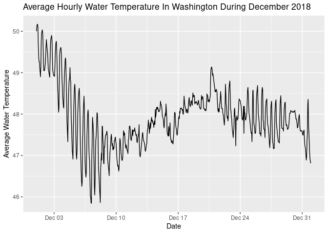

<!-- README.md is generated from README.Rmd. Please edit that file -->

[](https://cran.r-project.org/package=noaaoceans)
[](https://cran.r-project.org/package=noaaoceans)
[](https://travis-ci.com/warlicks/noaaoceans)
[](https://ci.appveyor.com/project/warlicks/noaaoceans)
[](https://codecov.io/gh/warlicks/noaaoceans)

# noaaoceans

The **noaaoceans** package is designed to facilitate access to various
National Oceanic and Atmospheric Administration (NOAA) data sources. The
current version focuses on accessing data from the [CO-OPS
API](https://tidesandcurrents.noaa.gov/api/). The package also
facilitates the collection of basic metadata for each of the stations
that collect the data available in the API.

## Installing

The current release of **noaaoceans** can be installed from CRAN.

``` r
install.packages('noaaoceans')
```

The development version can be installed via GitHub with
[remotes](https://CRAN.R-project.org/package=remotes)

``` r
remotes::install_github('warlicks/noaaoceans')
```

## Examples

### Find all the CO-OPS stations in Washington.

``` r
library(noaaoceans)
library(dplyr)
library(ggplot2)
library(maps)
library(mapdata)

# Get a list of all the stations.
station_df <- list_coops_stations()

# Filter to stations in Washington with Water Temp Sensor
wa_station <- station_df %>% 
    filter(station_state == 'WA' & water_temp == '1')
wa_station %>% dplyr::as_tibble(.) %>% head()
#> # A tibble: 6 x 15
#>   station_id station_names station_state station_lat station_long
#>   <chr>      <chr>         <chr>         <chr>       <chr>       
#> 1 9440422    Longview      WA            46.1061     -122.9542   
#> 2 9440910    Toke Point    WA            46.7075     -123.9669   
#> 3 9441102    Westport      WA            46.9043     -124.1051   
#> 4 9442396    La Push, Qui… WA            47.913      -124.6369   
#> 5 9443090    Neah Bay      WA            48.3703     -124.6019   
#> 6 9444090    Port Angeles  WA            48.125      -123.44     
#> # … with 10 more variables: date_established <chr>, water_level <chr>,
#> #   winds <chr>, air_temp <chr>, water_temp <chr>, air_pressure <chr>,
#> #   conductivity <chr>, visibility <chr>, humidity <chr>, air_gap <chr>
```

### Query API For Water Temperature Data

``` r
# Create an empty storage data frame. 
water_temp <- data.frame()

# Loop through the station and call the API for each station
for (i in wa_station$station_id) {
    query_df <- query_coops_data(station_id = i,
                                 start_date = '20181201',
                                 end_date = '20181231',
                                 data_product = 'water_temperature',
                                 interval = 'h') # hourly readings
    
    # Add current station results to the storage data frame 
    water_temp <- water_temp %>% bind_rows(., query_df)
}

water_temp %>% as_tibble(.) %>% head()
#> # A tibble: 6 x 4
#>   t                v     f     station
#>   <chr>            <chr> <chr> <chr>  
#> 1 2018-12-01 00:00 48.4  0,0,0 9440422
#> 2 2018-12-01 01:00 48.4  0,0,0 9440422
#> 3 2018-12-01 02:00 48.4  0,0,0 9440422
#> 4 2018-12-01 03:00 48.4  0,0,0 9440422
#> 5 2018-12-01 04:00 48.4  0,0,0 9440422
#> 6 2018-12-01 05:00 48.4  0,0,0 9440422
```

### Plot the Average Water Temp

``` r
# Correct data types. 
water_temp <- water_temp %>% 
    mutate(v = as.numeric(v), t = as.POSIXct(t))

water_temp %>% 
    group_by(t) %>% 
    # Compute the hourly average. 
    summarise(avg_temp = mean(v, na.rm = TRUE)) %>% 
    # Plot the hourly average. 
    ggplot(aes(x = t, y = avg_temp)) +
    geom_path() +
    labs(x = "Date",
         y = 'Average Water Temperature',
         title = 'Average Hourly Water Temperature In Washington During December 2018')
```

<!-- -->
